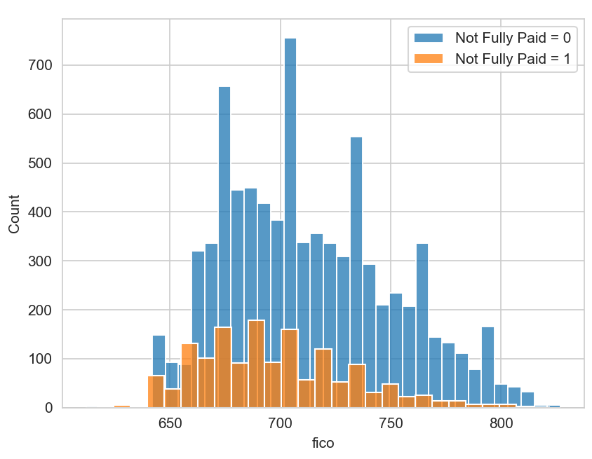
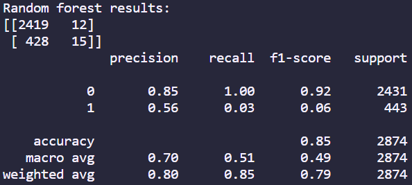

# Decision Tree vs Random Forest: Predicting Loan Payback

## Description

In this project I used Decision Trees and Random Forest to predict loan payback and then compared the 2 models to see which performed better. The technologies used were:

- python 
- sklearn
- panda
- seaborn
- matplotlib

The main challenge faced during this challenge was learning how to compare classification models by evaluating their classification reports.

## Installation

To install this project you will have to download the repository from github and runit locally from your CLI. To be able to use this project python will have to be installed, which can be found [here](https://www.python.org/downloads/).

## Usage

Once installed you can use this project by entering the repository location using your CLI. Once entered into the repository you can run the project by first entering ```source .venv/Scripts/activate``` and then entering ```python TreeMethods.py``` in the CLI.

Once run a graph will show up as well as a confusion matrix and classification report, similar to these examples below:


